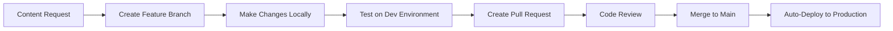
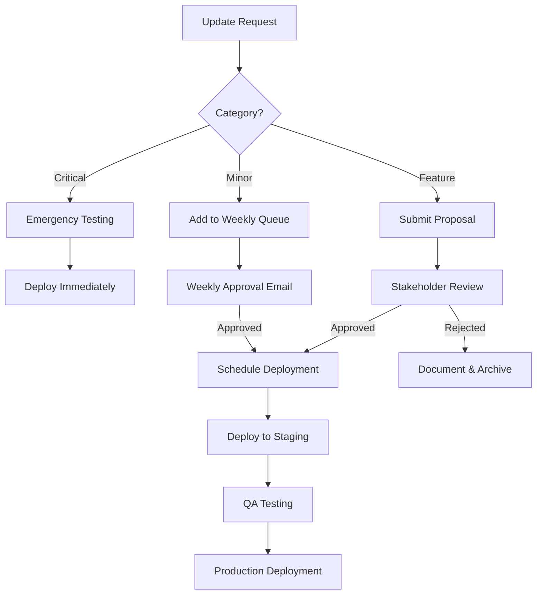
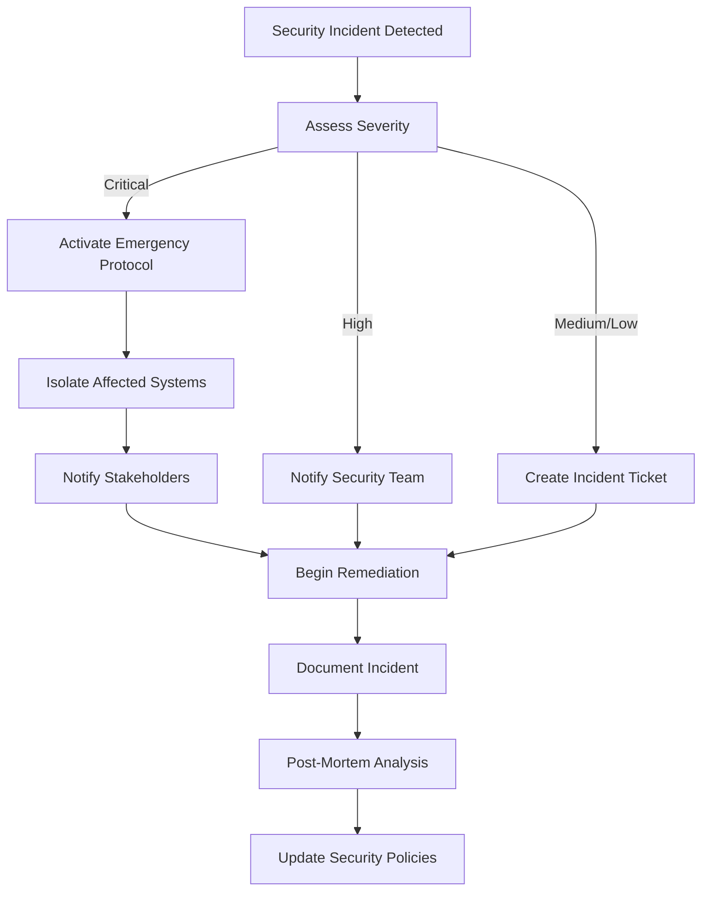

# Guri24 & Suqafuran Technical Operations Plan

## Executive Summary

This document outlines the comprehensive strategy, tools, and workflows for managing, monitoring, and maintaining the Guri24 real estate platform and providing technical support for Suqafuran once it goes live. The plan ensures system reliability, security, performance optimization, and controlled change management.

---

## 1. Monitoring and Maintenance of Guri24

### 1.1 Infrastructure Monitoring

#### Tools & Services
- **Vercel Analytics** (Primary Hosting Platform)
  - Real-time performance metrics
  - Deployment status monitoring
  - Traffic analytics
  - Core Web Vitals tracking
  
- **Google Analytics 4 (GA4)**
  - User behavior tracking
  - Conversion funnel analysis
  - Traffic source attribution
  - Custom event tracking

- **Sentry** (Error Tracking & Performance Monitoring)
  - Real-time error alerts
  - Stack trace analysis
  - Performance bottleneck identification
  - User session replay

- **UptimeRobot** (Uptime Monitoring)
  - 5-minute interval checks
  - Multi-location monitoring
  - SMS/Email alerts for downtime
  - Status page generation

#### Implementation Strategy

**Weekly Monitoring Checklist:**
```markdown
- [ ] Review Vercel deployment logs
- [ ] Check error rates in Sentry (target: <0.1%)
- [ ] Verify uptime metrics (target: 99.9%)
- [ ] Analyze Core Web Vitals (LCP, FID, CLS)
- [ ] Review traffic patterns and anomalies
- [ ] Check SSL certificate expiration
- [ ] Verify DNS configuration
```

**Automated Alerts Setup:**
- Downtime > 2 minutes → SMS + Email
- Error rate > 1% → Email notification
- Page load time > 3s → Slack notification
- Failed deployment → Immediate SMS alert

### 1.2 Performance Optimization

#### Tools
- **Lighthouse CI**
  - Automated performance audits on each deployment
  - Performance budget enforcement
  - Accessibility compliance checks

- **WebPageTest**
  - Monthly comprehensive performance analysis
  - Multi-location speed testing
  - Waterfall analysis

#### Maintenance Tasks

**Monthly Performance Review:**
```javascript
// Performance Budget Thresholds
{
  "metrics": {
    "first-contentful-paint": 1800,
    "largest-contentful-paint": 2500,
    "cumulative-layout-shift": 0.1,
    "total-blocking-time": 300,
    "speed-index": 3000
  }
}
```

**Optimization Actions:**
- Image optimization review (WebP conversion, lazy loading)
- Bundle size analysis (target: <200KB initial JS)
- Unused code elimination
- CDN cache hit rate optimization
- Database query performance tuning

### 1.3 Content Management

#### Tools
- **Git Version Control** (GitHub/GitLab)
  - All code changes tracked
  - Branch protection rules
  - Pull request reviews mandatory

- **Content Update Workflow:**


---

## 2. Supporting Suqafuran Once Live

### 2.1 Technical Support Framework

#### Support Tiers

**Tier 1: Immediate Response (Critical)**
- System downtime
- Security breaches
- Data loss incidents
- Payment processing failures

**Response Time:** 15 minutes  
**Tools:** PagerDuty, Twilio SMS alerts

**Tier 2: High Priority**
- Performance degradation
- Feature malfunctions
- User-reported bugs

**Response Time:** 2 hours  
**Tools:** Zendesk, Slack integration

**Tier 3: Standard**
- Feature requests
- Minor UI issues
- Content updates

**Response Time:** 24 hours  
**Tools:** Trello, Email

#### Support Tools Stack

1. **Zendesk** (Ticketing System)
   - Centralized support ticket management
   - SLA tracking
   - Customer communication history
   - Knowledge base integration

2. **Slack** (Internal Communication)
   - Dedicated #suqafuran-support channel
   - Integration with monitoring tools
   - Quick team collaboration

3. **LogRocket** (Session Replay)
   - Visual reproduction of user issues
   - Console log capture
   - Network request inspection

### 2.2 Deployment & Update Process

#### Staging Environment
```bash
# Staging deployment workflow
git checkout develop
git pull origin develop
npm run build
vercel --prod --scope=staging
```

#### Production Deployment
```bash
# Production deployment (requires approval)
git checkout main
git merge develop
npm run test
npm run build
vercel --prod
```

**Deployment Checklist:**
```markdown
- [ ] All tests passing (unit + integration)
- [ ] Lighthouse score > 90
- [ ] No critical Sentry errors in staging
- [ ] Database migrations tested
- [ ] Rollback plan documented
- [ ] Stakeholder approval received
- [ ] Deployment window scheduled (low-traffic hours)
```

---

## 3. Approved Technical Updates

### 3.1 Change Management Process

#### Update Categories

**Category A: Critical Security Updates**
- Immediate deployment after testing
- No approval required (emergency protocol)
- Post-deployment notification

**Category B: Feature Enhancements**
- Requires written approval
- 48-hour review period
- Staging environment testing mandatory

**Category C: Minor Updates**
- Weekly batch deployment
- Email approval sufficient
- Grouped in release notes

#### Approval Workflow



### 3.2 Update Documentation

**Required Documentation for Each Update:**

```markdown
## Update Request Form

**Update ID:** UR-2025-001
**Category:** [Critical/Feature/Minor]
**Requested By:** [Name]
**Date:** YYYY-MM-DD

### Description
[Detailed description of the update]

### Business Justification
[Why this update is needed]

### Technical Impact
- Affected Components: [List]
- Database Changes: [Yes/No - Details]
- API Changes: [Yes/No - Details]
- Breaking Changes: [Yes/No - Details]

### Testing Plan
- [ ] Unit tests written
- [ ] Integration tests passed
- [ ] Manual QA completed
- [ ] Performance impact assessed

### Rollback Plan
[Step-by-step rollback procedure]

### Approval
- [ ] Technical Lead: ___________
- [ ] Project Manager: ___________
- [ ] Client Stakeholder: ___________
```

---

## 4. Analytics and Reporting

### 4.1 Analytics Tools

#### Google Analytics 4 Setup

**Key Metrics Tracked:**
```javascript
// Custom Events Configuration
gtag('event', 'property_view', {
  property_id: 'prop_123',
  property_type: 'apartment',
  location: 'Nairobi',
  price_range: '50000-100000'
});

gtag('event', 'contact_form_submit', {
  form_type: 'inquiry',
  property_id: 'prop_123'
});

gtag('event', 'search_performed', {
  search_type: 'buy',
  location: 'Westlands',
  filters_applied: ['3bed', 'parking']
});
```

#### Reporting Dashboard Tools

1. **Google Data Studio** (Primary Reporting)
   - Custom dashboards for stakeholders
   - Automated weekly reports
   - Real-time data visualization

2. **Mixpanel** (Advanced Analytics)
   - User journey analysis
   - Cohort analysis
   - Funnel conversion tracking
   - A/B test results

3. **Hotjar** (User Behavior)
   - Heatmaps
   - Session recordings
   - User feedback polls
   - Conversion funnel analysis

### 4.2 Reporting Schedule

#### Weekly Reports (Every Monday 9 AM)

**Email Report Contents:**
```markdown
# Guri24 Weekly Performance Report
Week of: [Date Range]

## Traffic Overview
- Total Visitors: X,XXX
- New vs Returning: XX% / XX%
- Top Traffic Sources: [List]
- Bounce Rate: XX%

## Property Engagement
- Most Viewed Properties: [Top 5]
- Search Queries: [Top 10]
- Contact Form Submissions: XXX

## Technical Health
- Uptime: 99.X%
- Average Page Load: X.Xs
- Error Rate: 0.X%
- Critical Issues: [None/List]

## Action Items
- [ ] [Any required actions]
```

#### Monthly Reports (First Friday of Month)

**Comprehensive Analysis:**
- Traffic trends and YoY comparison
- Conversion rate analysis
- User demographics
- Device/browser breakdown
- SEO performance metrics
- Competitor analysis
- Feature usage statistics
- Revenue attribution (if applicable)

#### Quarterly Business Reviews

**Strategic Insights:**
- Platform growth metrics
- User retention analysis
- Feature adoption rates
- Technical debt assessment
- Infrastructure cost analysis
- Roadmap recommendations

### 4.3 Real-Time Dashboards

**Vercel Analytics Dashboard:**
- Live visitor count
- Current deployment status
- Real-time error tracking
- Geographic distribution

**Custom Monitoring Dashboard (Grafana):**
```yaml
# Dashboard Configuration
panels:
  - title: "Response Time"
    type: graph
    targets:
      - metric: "http_request_duration_ms"
        
  - title: "Error Rate"
    type: stat
    targets:
      - metric: "error_count_per_minute"
      
  - title: "Active Users"
    type: gauge
    targets:
      - metric: "active_sessions"
```

---

## 5. Website Security Management

### 5.1 Security Tools & Services

#### 1. **Cloudflare** (Web Application Firewall)

**Features Enabled:**
- DDoS protection
- Bot management
- SSL/TLS encryption (Full Strict mode)
- Rate limiting
- IP reputation filtering

**Configuration:**
```javascript
// Cloudflare Security Rules
{
  "rules": [
    {
      "action": "challenge",
      "expression": "(http.request.uri.path contains \"/admin\" and not ip.geoip.country in {\"KE\" \"US\"})"
    },
    {
      "action": "block",
      "expression": "(cf.threat_score > 50)"
    }
  ]
}
```

#### 2. **Snyk** (Dependency Vulnerability Scanning)

**Automated Scans:**
- Daily dependency checks
- Pull request security analysis
- License compliance verification
- Automated fix PRs for vulnerabilities

**Integration:**
```yaml
# .github/workflows/security.yml
name: Security Scan
on: [push, pull_request]
jobs:
  security:
    runs-on: ubuntu-latest
    steps:
      - uses: actions/checkout@v2
      - uses: snyk/actions/node@master
        env:
          SNYK_TOKEN: ${{ secrets.SNYK_TOKEN }}
```

#### 3. **OWASP ZAP** (Penetration Testing)

**Monthly Security Audits:**
- Automated vulnerability scanning
- SQL injection testing
- XSS vulnerability detection
- Authentication testing
- Session management review

#### 4. **AWS Secrets Manager** (Sensitive Data)

**Secrets Management:**
```javascript
// Environment variables stored securely
{
  "DATABASE_URL": "encrypted_connection_string",
  "API_KEYS": "encrypted_keys",
  "JWT_SECRET": "encrypted_secret",
  "STRIPE_SECRET": "encrypted_key"
}
```

### 5.2 Security Protocols

#### Access Control

**Role-Based Access Control (RBAC):**

```javascript
// User Roles & Permissions
const roles = {
  SUPER_ADMIN: {
    permissions: ['*'], // All permissions
    users: ['primary_admin@guri24.com']
  },
  ADMIN: {
    permissions: [
      'content.edit',
      'users.view',
      'analytics.view',
      'properties.manage'
    ],
    users: ['admin@guri24.com']
  },
  CONTENT_EDITOR: {
    permissions: [
      'content.edit',
      'properties.edit'
    ],
    users: ['editor@guri24.com']
  },
  SUPPORT: {
    permissions: [
      'tickets.view',
      'users.view',
      'analytics.view'
    ],
    users: ['support@guri24.com']
  }
};
```

#### Authentication & Authorization

**Implementation:**
- JWT-based authentication
- 2FA mandatory for admin accounts
- Session timeout: 30 minutes of inactivity
- Password requirements: 12+ characters, complexity rules
- Failed login lockout: 5 attempts = 15-minute lockout

**Code Example:**
```javascript
// Middleware for protected routes
const authenticateAdmin = async (req, res, next) => {
  try {
    const token = req.headers.authorization?.split(' ')[1];
    const decoded = jwt.verify(token, process.env.JWT_SECRET);
    
    // Verify 2FA if required
    if (decoded.requires2FA && !req.body.twoFactorCode) {
      return res.status(403).json({ error: '2FA required' });
    }
    
    req.user = decoded;
    next();
  } catch (error) {
    res.status(401).json({ error: 'Unauthorized' });
  }
};
```

### 5.3 Data Protection

#### Backup Strategy

**Automated Backups:**
```yaml
# Backup Schedule
Daily:
  - Database: Full backup at 2 AM EAT
  - User uploads: Incremental backup
  - Configuration: Version-controlled

Weekly:
  - Complete system snapshot
  - Backup verification test

Monthly:
  - Long-term archive to cold storage
  - Disaster recovery drill
```

**Backup Tools:**
- **Vercel**: Automatic deployment snapshots
- **AWS S3**: Database backups (encrypted at rest)
- **GitHub**: Code repository (private)

#### Data Encryption

**At Rest:**
- Database: AES-256 encryption
- File storage: Server-side encryption (SSE-S3)
- Backups: Encrypted before upload

**In Transit:**
- HTTPS only (TLS 1.3)
- HSTS enabled
- Certificate pinning for API calls

### 5.4 Security Incident Response

**Incident Response Plan:**



**Response Team:**
- **Incident Commander:** Technical Lead
- **Communications:** Project Manager
- **Technical Response:** DevOps Engineer
- **Legal/Compliance:** (External consultant if needed)

---

## 6. Weekly Updates

### 6.1 Update Delivery Format

**Weekly Status Email Template:**

```markdown
Subject: Guri24 Weekly Update - Week [XX], 2025

Hi [Stakeholder Name],

Here's your weekly update for Guri24:

## 🚀 Deployments This Week
- [Date]: [Description of update]
  - Status: ✅ Successful / ⚠️ Rolled back
  - Impact: [Brief description]

## 📊 Performance Metrics
- Uptime: 99.X%
- Avg Response Time: XXXms
- Total Visitors: X,XXX
- New Properties Listed: XX

## 🐛 Issues Resolved
- [Issue #1]: [Description] - Status: Resolved
- [Issue #2]: [Description] - Status: In Progress

## 🔒 Security Updates
- [Any security patches applied]
- [Vulnerability scans: Clean/Issues found]

## 📅 Next Week's Plan
- [ ] [Planned update 1]
- [ ] [Planned update 2]

## ⚠️ Action Required
- [Any items requiring stakeholder input/approval]

Best regards,
[Your Name]
Technical Operations Manager
```

### 6.2 Communication Channels

**Primary Channels:**
1. **Email:** Weekly reports, formal approvals
2. **Slack:** Real-time updates, urgent issues
3. **Trello/Asana:** Task tracking, project management
4. **Loom Videos:** Complex update demonstrations

**Slack Channel Structure:**
```
#guri24-general          → General discussions
#guri24-deployments      → Deployment notifications
#guri24-alerts           → Automated monitoring alerts
#guri24-support          → User support issues
#suqafuran-support       → Suqafuran-specific support
```

---

## 7. Approval-Based Major Changes

### 7.1 Change Request Process

**Major Change Definition:**
- New feature additions
- Database schema changes
- Third-party integrations
- UI/UX overhauls
- Infrastructure migrations
- Pricing/payment changes

**Approval Workflow:**

```markdown
## Major Change Request Form

**Change ID:** MCR-2025-001
**Submitted By:** [Name]
**Date:** YYYY-MM-DD
**Priority:** [Low/Medium/High/Critical]

### Change Description
[Detailed description of proposed change]

### Business Case
**Problem Statement:**
[What problem does this solve?]

**Expected Benefits:**
- [Benefit 1]
- [Benefit 2]

**Success Metrics:**
- [How will we measure success?]

### Technical Specification
**Architecture Changes:**
[Diagram or description]

**Dependencies:**
- [External services]
- [Internal components]

**Database Changes:**
```sql
-- Migration script preview
ALTER TABLE properties ADD COLUMN virtual_tour_url VARCHAR(255);
```

**API Changes:**
```javascript
// New endpoint
POST /api/properties/:id/schedule-viewing
{
  "date": "2025-01-15",
  "time": "14:00",
  "visitor_name": "John Doe",
  "visitor_email": "john@example.com"
}
```

### Risk Assessment
**Potential Risks:**
- [Risk 1]: Likelihood: [Low/Med/High], Impact: [Low/Med/High]
- [Risk 2]: Likelihood: [Low/Med/High], Impact: [Low/Med/High]

**Mitigation Strategies:**
- [How we'll address each risk]

### Resource Requirements
- Development Time: X hours
- Testing Time: X hours
- Deployment Window: [Date/Time]
- Budget: $XXX (if applicable)

### Testing Plan
- [ ] Unit tests
- [ ] Integration tests
- [ ] User acceptance testing
- [ ] Performance testing
- [ ] Security review

### Rollback Plan
**Rollback Trigger Conditions:**
- [Condition 1]
- [Condition 2]

**Rollback Procedure:**
1. [Step 1]
2. [Step 2]
3. [Step 3]

### Approval Signatures
- [ ] Technical Lead: ___________ Date: ______
- [ ] Project Manager: ___________ Date: ______
- [ ] Client Stakeholder: ___________ Date: ______

### Post-Deployment Review
**Actual vs Expected:**
[To be filled after deployment]

**Lessons Learned:**
[To be filled after deployment]
```

### 7.2 Approval Tracking

**Tools:**
- **DocuSign:** Electronic signatures for formal approvals
- **Notion:** Change request database
- **GitHub Issues:** Technical discussion and tracking

**Approval SLA:**
- Low Priority: 5 business days
- Medium Priority: 3 business days
- High Priority: 1 business day
- Critical: 4 hours

---

## 8. Limited Admin Access

### 8.1 Access Control Implementation

**Principle of Least Privilege:**

```javascript
// Access Control Matrix
const accessMatrix = {
  // Database Access
  database: {
    production: ['super_admin'],
    staging: ['super_admin', 'admin', 'developer'],
    development: ['*']
  },
  
  // Server Access
  server: {
    ssh: ['super_admin'],
    logs: ['super_admin', 'admin'],
    monitoring: ['super_admin', 'admin', 'support']
  },
  
  // Code Repository
  repository: {
    merge_to_main: ['super_admin', 'tech_lead'],
    create_pr: ['developer', 'admin'],
    view_code: ['*']
  },
  
  // Admin Panel
  admin_panel: {
    user_management: ['super_admin'],
    content_management: ['admin', 'content_editor'],
    analytics_view: ['admin', 'support'],
    settings: ['super_admin']
  }
};
```

### 8.2 Access Audit Trail

**Logging All Admin Actions:**

```javascript
// Audit Log Schema
{
  "timestamp": "2025-01-15T14:30:00Z",
  "user_id": "admin_123",
  "user_email": "admin@guri24.com",
  "action": "property.delete",
  "resource_id": "prop_456",
  "ip_address": "197.xxx.xxx.xxx",
  "user_agent": "Mozilla/5.0...",
  "changes": {
    "before": { /* previous state */ },
    "after": { /* new state */ }
  },
  "status": "success"
}
```

**Audit Review:**
- Daily automated review of critical actions
- Weekly manual review by security team
- Monthly compliance report

### 8.3 Access Request Process

**New Access Request:**

```markdown
## Access Request Form

**Requester:** [Name]
**Email:** [Email]
**Role:** [Current Role]
**Date:** YYYY-MM-DD

### Access Requested
**System/Resource:** [e.g., Production Database]
**Access Level:** [Read/Write/Admin]
**Duration:** [Temporary: X days / Permanent]

### Justification
[Why is this access needed?]

### Approval Chain
- [ ] Direct Manager: ___________
- [ ] Technical Lead: ___________
- [ ] Security Officer: ___________

### Access Granted
**Date:** YYYY-MM-DD
**Granted By:** [Name]
**Credentials Issued:** [Yes/No]
**Expiration Date:** [If temporary]

### Access Revocation
**Date:** YYYY-MM-DD
**Revoked By:** [Name]
**Reason:** [Reason for revocation]
```

**Access Review Schedule:**
- Quarterly: Review all active access
- Annually: Recertification of all admin accounts
- On departure: Immediate revocation

---

## 9. Confidentiality and System Protection

### 9.1 Non-Disclosure Agreement (NDA)

**Required for:**
- All team members with system access
- Third-party contractors
- Support staff

**Key Clauses:**
- Confidential information definition
- Non-disclosure obligations
- Data handling procedures
- Breach consequences
- Duration of confidentiality

### 9.2 Data Classification

**Classification Levels:**

```javascript
const dataClassification = {
  PUBLIC: {
    examples: ['Property listings', 'Blog posts', 'Public pages'],
    handling: 'No special protection required',
    encryption: 'Optional'
  },
  
  INTERNAL: {
    examples: ['Analytics data', 'Internal docs', 'System logs'],
    handling: 'Access restricted to employees',
    encryption: 'In transit'
  },
  
  CONFIDENTIAL: {
    examples: ['User emails', 'Phone numbers', 'Search history'],
    handling: 'Need-to-know basis only',
    encryption: 'At rest and in transit'
  },
  
  RESTRICTED: {
    examples: ['Passwords', 'Payment info', 'API keys'],
    handling: 'Strict access controls, audit logging',
    encryption: 'Strong encryption, key rotation'
  }
};
```

### 9.3 Secure Development Practices

**Code Security Standards:**

```javascript
// Example: Input Validation
const validatePropertyInput = (data) => {
  const schema = Joi.object({
    title: Joi.string().max(200).required(),
    price: Joi.number().positive().required(),
    description: Joi.string().max(5000).required(),
    location: Joi.object({
      city: Joi.string().required(),
      address: Joi.string().max(500)
    })
  });
  
  return schema.validate(data);
};

// Example: SQL Injection Prevention
const getPropertyById = async (id) => {
  // Using parameterized queries
  const query = 'SELECT * FROM properties WHERE id = $1';
  return await db.query(query, [id]);
};

// Example: XSS Prevention
const sanitizeUserInput = (input) => {
  return DOMPurify.sanitize(input, {
    ALLOWED_TAGS: ['b', 'i', 'em', 'strong'],
    ALLOWED_ATTR: []
  });
};
```

**Security Code Review Checklist:**
```markdown
- [ ] Input validation on all user inputs
- [ ] Parameterized queries (no string concatenation)
- [ ] Output encoding for XSS prevention
- [ ] Authentication checks on protected routes
- [ ] Authorization checks for data access
- [ ] Sensitive data not logged
- [ ] Secrets not hardcoded
- [ ] HTTPS enforced
- [ ] CORS properly configured
- [ ] Rate limiting implemented
```

### 9.4 Incident Confidentiality

**Security Incident Communication Protocol:**

1. **Internal Communication:**
   - Immediate: Security team only
   - Within 2 hours: Management team
   - Within 24 hours: All affected staff

2. **External Communication:**
   - Legal review required before any public disclosure
   - Coordinated disclosure timeline
   - PR team involvement for messaging

3. **User Notification:**
   - Required if personal data compromised
   - Within 72 hours of discovery (GDPR compliance)
   - Clear, non-technical language
   - Remediation steps provided

---

## 10. Tools Summary & Cost Breakdown

### 10.1 Complete Tools Stack

| Category | Tool | Purpose | Cost (Monthly) |
|----------|------|---------|----------------|
| **Hosting** | Vercel Pro | Frontend hosting, analytics | $20 |
| **Monitoring** | Sentry | Error tracking | $26 |
| **Monitoring** | UptimeRobot | Uptime monitoring | $7 |
| **Analytics** | Google Analytics 4 | Web analytics | Free |
| **Analytics** | Mixpanel | Advanced analytics | $25 |
| **Analytics** | Hotjar | User behavior | $39 |
| **Security** | Cloudflare Pro | WAF, DDoS protection | $20 |
| **Security** | Snyk | Dependency scanning | $0 (Open source) |
| **Support** | Zendesk | Ticketing system | $49 |
| **Communication** | Slack Pro | Team communication | $8/user |
| **Session Replay** | LogRocket | User session replay | $99 |
| **Reporting** | Google Data Studio | Dashboards | Free |
| **Secrets** | AWS Secrets Manager | Secure storage | $0.40 |
| **Backup** | AWS S3 | Backup storage | ~$5 |
| **Testing** | Lighthouse CI | Performance testing | Free |
| **Signatures** | DocuSign | Electronic signatures | $25 |
| **Project Mgmt** | Trello/Asana | Task tracking | $10 |
| **Total** | | | **~$333/month** |

### 10.2 Setup & Configuration Timeline

**Week 1: Foundation**
- [ ] Set up Vercel deployment
- [ ] Configure Cloudflare WAF
- [ ] Initialize Git repository with branch protection
- [ ] Set up development/staging/production environments

**Week 2: Monitoring**
- [ ] Integrate Sentry error tracking
- [ ] Configure UptimeRobot checks
- [ ] Set up Google Analytics 4
- [ ] Create initial Grafana dashboards

**Week 3: Security**
- [ ] Implement authentication system
- [ ] Configure Snyk scans
- [ ] Set up AWS Secrets Manager
- [ ] Create backup automation scripts

**Week 4: Support & Reporting**
- [ ] Configure Zendesk
- [ ] Set up Slack channels and integrations
- [ ] Create reporting templates
- [ ] Document all processes

---

## 11. Standard Operating Procedures (SOPs)

### 11.1 Daily Operations

**Morning Routine (9:00 AM EAT):**
```markdown
- [ ] Check overnight monitoring alerts
- [ ] Review Sentry error dashboard
- [ ] Verify backup completion
- [ ] Check support ticket queue
- [ ] Review deployment logs
```

**Evening Routine (6:00 PM EAT):**
```markdown
- [ ] Summarize day's activities
- [ ] Update task board
- [ ] Schedule next day's deployments
- [ ] Ensure all critical tickets addressed
```

### 11.2 Emergency Procedures

**System Down Procedure:**

```markdown
1. IMMEDIATE (0-5 minutes)
   - Confirm outage via multiple sources
   - Check Vercel status page
   - Notify stakeholders via SMS
   - Activate incident response team

2. ASSESSMENT (5-15 minutes)
   - Identify root cause
   - Estimate recovery time
   - Determine if rollback needed
   - Update status page

3. RESOLUTION (15-60 minutes)
   - Execute recovery plan
   - Monitor system stability
   - Verify all services operational
   - Document incident

4. POST-INCIDENT (Within 24 hours)
   - Send incident report
   - Conduct post-mortem
   - Update runbooks
   - Implement preventive measures
```

### 11.3 Deployment SOP

**Standard Deployment Procedure:**

```bash
#!/bin/bash
# deployment.sh

# 1. Pre-deployment checks
echo "Running pre-deployment checks..."
npm run test
npm run lint
npm run build

# 2. Create deployment tag
git tag -a v1.2.3 -m "Release v1.2.3: Feature XYZ"
git push origin v1.2.3

# 3. Deploy to staging
echo "Deploying to staging..."
vercel --prod --scope=staging

# 4. Run smoke tests
echo "Running smoke tests..."
npm run test:e2e:staging

# 5. Request approval
echo "Deployment to staging complete. Awaiting approval for production..."
read -p "Proceed to production? (yes/no): " approval

if [ "$approval" == "yes" ]; then
  # 6. Deploy to production
  echo "Deploying to production..."
  vercel --prod
  
  # 7. Post-deployment verification
  echo "Running post-deployment checks..."
  curl -f https://guri24.com/api/health || echo "Health check failed!"
  
  # 8. Notify stakeholders
  echo "Sending deployment notification..."
  # (Slack webhook or email notification)
  
  echo "Deployment complete!"
else
  echo "Deployment cancelled."
fi
```

---

## 12. Compliance & Legal

### 12.1 Data Protection Compliance

**GDPR Compliance (if applicable):**
- Right to access: User data export feature
- Right to erasure: Account deletion functionality
- Data portability: Export in machine-readable format
- Consent management: Clear opt-in/opt-out mechanisms

**Implementation:**
```javascript
// User data export endpoint
app.get('/api/user/export-data', authenticateUser, async (req, res) => {
  const userData = await db.getUserData(req.user.id);
  const exportData = {
    profile: userData.profile,
    properties_viewed: userData.viewHistory,
    searches: userData.searchHistory,
    saved_properties: userData.savedProperties,
    messages: userData.messages
  };
  
  res.json(exportData);
});

// Account deletion endpoint
app.delete('/api/user/account', authenticateUser, async (req, res) => {
  await db.anonymizeUserData(req.user.id);
  await db.deleteUser(req.user.id);
  res.json({ message: 'Account deleted successfully' });
});
```

### 12.2 Terms of Service & Privacy Policy

**Regular Review Schedule:**
- Quarterly: Review for accuracy
- Annually: Legal compliance audit
- On major feature launch: Update if needed

**Version Control:**
- All versions stored in Git
- Users notified of material changes
- Acceptance required for continued use

---

## 13. Knowledge Base & Documentation

### 13.1 Internal Documentation

**Documentation Structure:**
```
/docs
  /architecture
    - system-overview.md
    - database-schema.md
    - api-documentation.md
  /operations
    - deployment-guide.md
    - monitoring-guide.md
    - troubleshooting.md
  /security
    - security-policies.md
    - incident-response.md
    - access-control.md
  /development
    - coding-standards.md
    - git-workflow.md
    - testing-guide.md
```

### 13.2 User-Facing Documentation

**Help Center Topics:**
- How to list a property
- How to search for properties
- Contact and inquiry process
- Account management
- Privacy and data handling
- Frequently asked questions

**Tools:** Zendesk Guide, Notion public pages

---

## 14. Continuous Improvement

### 14.1 Quarterly Reviews

**Q1, Q2, Q3, Q4 Review Agenda:**
```markdown
## Quarterly Technical Review

### Performance Review
- Uptime achievement vs target
- Page load time trends
- Error rate analysis
- User satisfaction scores

### Security Review
- Vulnerabilities discovered and patched
- Security incidents (if any)
- Compliance status
- Access audit findings

### Process Improvement
- What went well?
- What could be improved?
- New tools or processes to adopt?
- Training needs identified

### Roadmap Planning
- Upcoming features
- Technical debt prioritization
- Infrastructure upgrades
- Team capacity planning
```

### 14.2 Metrics & KPIs

**Technical KPIs:**
- Uptime: Target 99.9%
- Mean Time to Recovery (MTTR): <30 minutes
- Deployment frequency: Weekly
- Change failure rate: <5%
- Page load time: <2 seconds
- Error rate: <0.1%

**Business KPIs:**
- User satisfaction: >4.5/5
- Support ticket resolution time: <24 hours
- Feature adoption rate: >60% within 30 days
- Conversion rate: Track and optimize

---

## Conclusion

This comprehensive technical operations plan provides a structured approach to managing Guri24 and supporting Suqafuran with professional-grade tools, processes, and security measures. The plan ensures:

✅ **Reliability:** 99.9% uptime through proactive monitoring  
✅ **Security:** Multi-layered protection and compliance  
✅ **Transparency:** Weekly updates and detailed reporting  
✅ **Control:** Approval-based change management  
✅ **Confidentiality:** Strict access controls and data protection  
✅ **Scalability:** Tools and processes that grow with the platform  

**Next Steps:**
1. Review and approve this plan
2. Provision required tools and accounts
3. Complete Week 1-4 setup timeline
4. Begin daily operations
5. Schedule first weekly update

---

**Document Version:** 1.0  
**Last Updated:** 2025-12-27  
**Next Review:** 2025-03-27  
**Owner:** Technical Operations Manager
